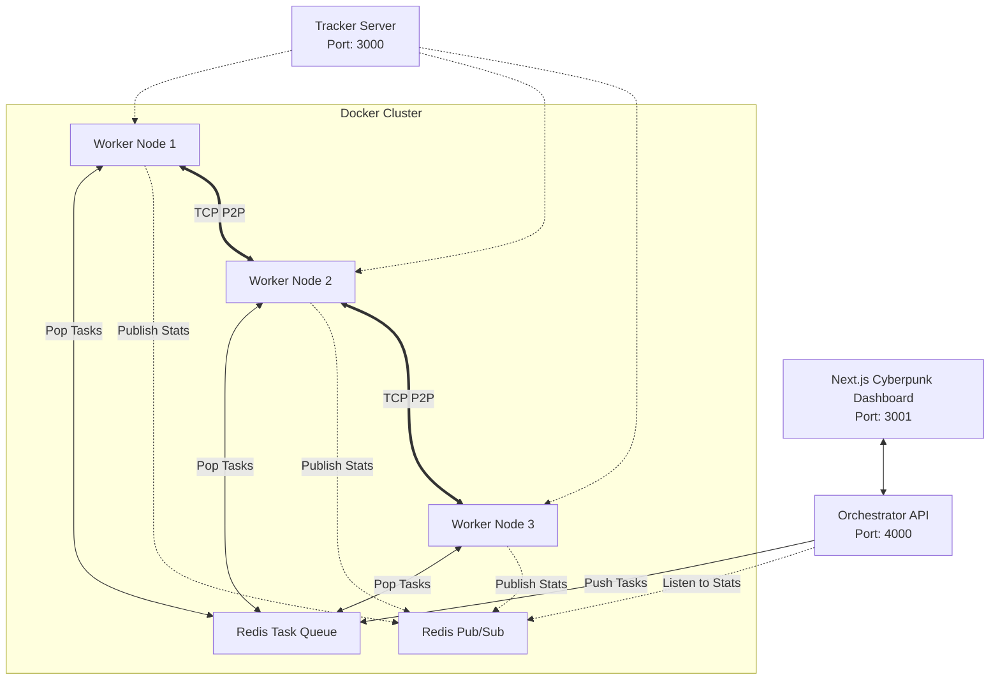

# ⚡ Distributed File Sharing & Task System

A fully functional, distributed peer-to-peer file sharing system built from scratch in Node.js, featuring a custom **Redis Messaging Layer**, **Dockerized Worker Nodes**, **Peer Failure Recovery**, and a premium **Cyberpunk Next.js Dashboard**.


## ✨ Core Features

- **Distributed File Sharing**: Peer-to-peer chunk-based transfers with rarest-first piece selection, SHA-1 piece verification, and decentralized node discovery (Tracker + DHT).
- **Custom Redis Messaging Layer**: Utilizes `ioredis` for Pub/Sub communication and task queuing between the central orchestrator and worker nodes.
- **Peer Failure Handling & Retry Logic**: The Orchestrator monitors worker heartbeats. If a Docker node fails, tasks are automatically requeued to surviving nodes.
- **Eventual Consistency**: Requeued tasks resume downloading instantly by synchronizing data from shared Docker volumes.
- **Containerized Architecture**: Uses `docker-compose` to spin up 3+ simulated worker nodes, Redis, the Orchestrator, and the Next.js UI locally.
- **Premium Cyberpunk Dashboard**: A stunning, animated dashboard built in Next.js to monitor cluster stats, manage nodes, and track torrent progression in real time.

## 🚀 Quick Start (Docker)

The entire cluster can be spun up using Docker Compose. Make sure Docker Desktop is running.

```bash
# Boot up Redis, the Orchestrator, and 3 Worker nodes
docker-compose up --build
```

Then, open your browser to the Cyberpunk Dashboard:
**[http://localhost:3001](http://localhost:3001)**

## 🏗️ Architecture



## 📂 Project Structure

```text
.
├── src/
│   ├── orchestrator.js       # Master API process & failure monitor
│   ├── worker-daemon.js      # Docker worker node daemon (Redis subscriber)
│   ├── worker.js             # Core P2P worker process
│   ├── peer/                 # P2P Protocol, piece manager, disk I/O
│   ├── shared/               # Redis Queue class, Metadata generators
│   └── tracker/              # HTTP Tracker Server
├── ui/                       # Next.js Cyberpunk Dashboard
├── uploads/                  # Seeded files (Shared Docker Volume)
├── downloads/                # Downloaded files (Shared Docker Volume)
├── torrents/                 # .torrent metadata (Shared Docker Volume)
├── docker-compose.yml        # Docker Cluster configuration
└── Dockerfile                # Multi-stage image build
```

## 💻 How It Works

1. **Upload & Seed**: Drag a file into the UI dashboard. The API creates metadata and pushes a `START_SEED` task to the **Redis Queue**.
2. **Worker Assignment**: An available Docker worker (`worker-daemon.js`) pops the task, forks the P2P process, and begins seeding the file.
3. **Share**: The UI displays a generated `infoHash`.
4. **Download**: Paste the `infoHash` into the UI. A `START_DOWNLOAD` task is pushed to Redis, picked up by *another* worker node, and the chunk-based P2P download begins.
5. **Failover Simulation**: Run `docker kill bit-lite-worker-1`. The Orchestrator will detect the missing heartbeat, realize the node failed, and push the active torrents back to the queue. Another surviving worker will pick it up, verify the downloaded pieces on disk, and seamlessly resume!

## 🌐 Management API Reference

The internal management API runs on `http://localhost:4000`:

| Endpoint             | Method | Description |
|----------------------|--------|-------------|
| `/api/start-seed`    | POST   | Uploads file, creates metadata, queues seeder task |
| `/api/start-download`| POST   | Accepts `infoHash`, queues leecher task |
| `/api/nodes`         | GET    | Lists active workers and swarm peers |
| `/api/stop-node/:id` | DELETE | Publishes STOP command via Redis |
| `/api/torrents`      | GET    | Lists all torrents tracked by the orchestrator |
| `/api/global-stats`  | GET    | Aggregate stats for the UI |
| `/api/download-file` | GET    | Extract completed files directly to your host |

---
*Built from scratch to demonstrate low-level P2P protocols combined with modern distributed systems and containerization.*
